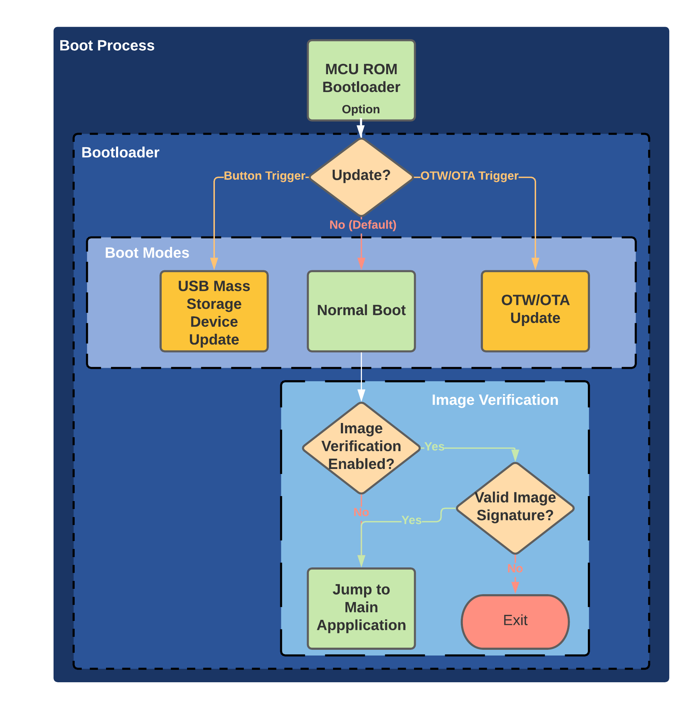
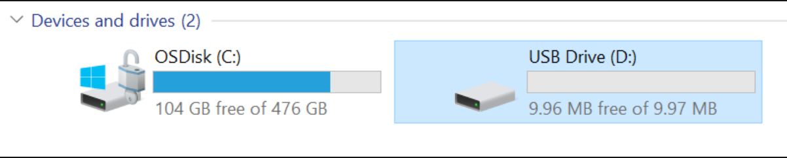

# **VIZN3D -Bootloader**

## **Overview**

The purpose of this document is to give a high-level overview of what the sln_bootloader application does as well as how to import, build, and flash the sln_bootloader application to your device.

- [**VIZN3D -Bootloader**](#vizn3d--bootloader)
  - [**Overview**](#overview)
  - [**What is the sln_bootloader?**](#what-is-the-sln_bootloader)
  - [**Image Verification**](#image-verification)
  - [**Boot Modes**](#boot-modes)
    - [**Normal Boot Mode**](#normal-boot-mode)
    - [**USB Mass Storage Device Update Mode**](#usb-mass-storage-device-update-mode)
      - [**What is USB Mass Storage Device Update Mode?**](#what-is-usb-mass-storage-device-update-mode)
      - [**How do I enable USB Mass Storage Device Update Mode?**](#how-do-i-enable-usb-mass-storage-device-update-mode)
    - [**OTW/OTA Update Mode**](#otwota-update-mode)
      - [**What are OTW/OTA Updates?**](#what-are-otwota-updates)
      - [**How do I trigger an OTW/OTA update?**](#how-do-i-trigger-an-otwota-update)
  - [**Additional Resources**](#additional-resources)

## **What is the sln_bootloader?**

The sln_bootloader project is a simple bootloader application which handles "pre-boot" startup tasks aimed primarily at handling the update of and verification/validity checking of a "main" application projects (ex. sln_smart_lock). **The bootloader runs prior to booting into the main application and is required to run any of these main application projects.**

The bootloader application features:

- Firmware Image Verification
- Over the Air Firmware Updates
- USB Mass Storage Device drag-and-drop Updates

Because the bootloader runs prior to the main app, **the bootloader is able to perform firmware updates of the main app** and **ensure that the main application binary flashed to the device came from a trusted source**, to prevent malicious and/or untrusted firmware images from ever running.

The boot flow for the sln_bootloader application is shown in the diagram below:

## **Image Verification**

---

***This feature is currently unsupported*

Image verification is used to protect against malicious and/or untrusted firmware images from running on the device. The bootloader application is able to verify the validity of firmware images by using a TLS-based image signature verification.

When image verification is enabled, during the normal/default boot sequence (no update being performed), the bootloader application will first verify that the image being jumped to has a valid signature that matches what the bootloader is expecting. Should a valid signature be found, the bootloader will boot jump to the main application to begin its execution. Otherwise, the bootloader will fail out and exit.

## **Boot Modes**

---

This is the default boot mode which simply jumps to the main application (smart_lock, smart_hmi, etc.). The flash address of the main application which the bootloader will jump to depends on which flash bank is currently set to 'Active' inside the FICA table (either bank A or bank B). The active bank is configured when a firmware update is performed using one of the bootloader's FW update methods (MSD, OTW/OTA).

***For more information on the FICA table, see the Developer's Guide for your device.*

### **Normal Boot Mode**

---

This is the default boot mode which simply jumps to the main application (smart_lock, smart_hmi, etc.). The flash address of the main application which the bootloader will jump to depends on which flash bank is currently set to 'Active' inside the FICA table (either bank A or bank B). The active bank is configured when a firmware update is performed using one of the bootloader's FW update methods (MSD, OTW/OTA).

***For more information on the FICA table, see the Developer's Guide for your device.*

### **USB Mass Storage Device Update Mode**

---
***The sln_bootloader application's USB Mass Storage Device Update mode has currently only officially been tested on Windows 10 environments.*

#### **What is USB Mass Storage Device Update Mode?**

The USB Mass Storage Device Update boot mode is a method by which firmware updates can be performed by simply copying a new firmware image to the board as if it were a regular USB flash drive. This method of performing firmware updates can be useful for providing users with a quick and easy update mechanism that does not require the use of external flashing tools like a Segger J-Link. This can be especially useful when providing updates to engineers in the field, marketers, and other stakeholders that may not have access to these kinds of external flashing and debugging tools.

#### **How do I enable USB Mass Storage Device Update Mode?**

To trigger the bootloader application's USB Mass Storage Device Update mode, simply press and hold the SW1 push button during bootloader startup.

Once USB Mass Storage Device Update mode is enabled, the RGB LED on the front of the kit will begin to blink purple and the kit will enumerate as a USB Storage Device if connected to a PC via a USB cable.

After MSD mode has been enabled, drag and drop an appropriate Bank A/Bank B binary as if copying a file to the USB device. Use a Bank A binary main app if the active flash bank address is currently set to Bank B, and a Bank B binary if the active flash bank is currently set to Bank A.

***For more details on Flash Bank configurations, see the Developers Guide for your device.*

After a brief delay, the device will begin flashing the new binary to its internal flash storage. If the device fails to flash an update, make sure you are using the appropriate Bank A/Bank B binary.

Once flashing has completed, the device will automatically reboot itself and begin running the newly flashed firmware (assuming a new update trigger has not been generated).

### **OTW/OTA Update Mode**

---

***Note: This feature is currently unsupported*

#### **What are OTW/OTA Updates?**

In addition to MSD drag-and-drop updates, the sln_bootloader project is also capable of performing Over-the-Air (OTA) and Over-the-Wire (OTW) updates which more closely resemble what could be used in a production environment than MSD updates. OTW and OTA updates performs three primary functions to transmit and flash firmware updates to VIZN3D devices:

1. **"Packetize" a firmware image**, breaking it into discrete transmittable packets
2. **Transmit the firmware images** from a "server" (usually running on a PC) over a wired or wireless connection
3. **Flash the new firmware image** to the target device.

#### **How do I trigger an OTW/OTA update?**

OTW and OTA updates can be **triggered by setting a bit in the FICA** which is checked during the bootloading process. **Setting the OTW or OTA FICA bit will typically be done in the "main" application (sln_smart_lock, sln_smart_hmi, etc.) via a shell command or other method.**

Once OTW/OTA Update Mode is enabled, the board will enter a waiting state until a firmware update has begun transmission. After beginning transmission, the kit will act as a client and the device which initiated the transfer will act as a server, sending the new binary via packets until the entire binary has been transmitted.

The device will automatically reset itself after the entire binary has been successfully transmitted and begin running the newly flashed firmware (assuming a new update trigger has not been generated).

***For more information on OTW/OTA updates, including the transmission protocol and the format required to send firmware packets via OTW/OTA, please see the Developer's Guide for your device.*

## **Additional Resources**

---

[VIZN3D Website](https://www.nxp.com/) - central location for all things VIZN3D-related
[Developer's Guide](https://www.nxp.com/) - document detailing features and information especially useful for developers working with the VIZN3D.
