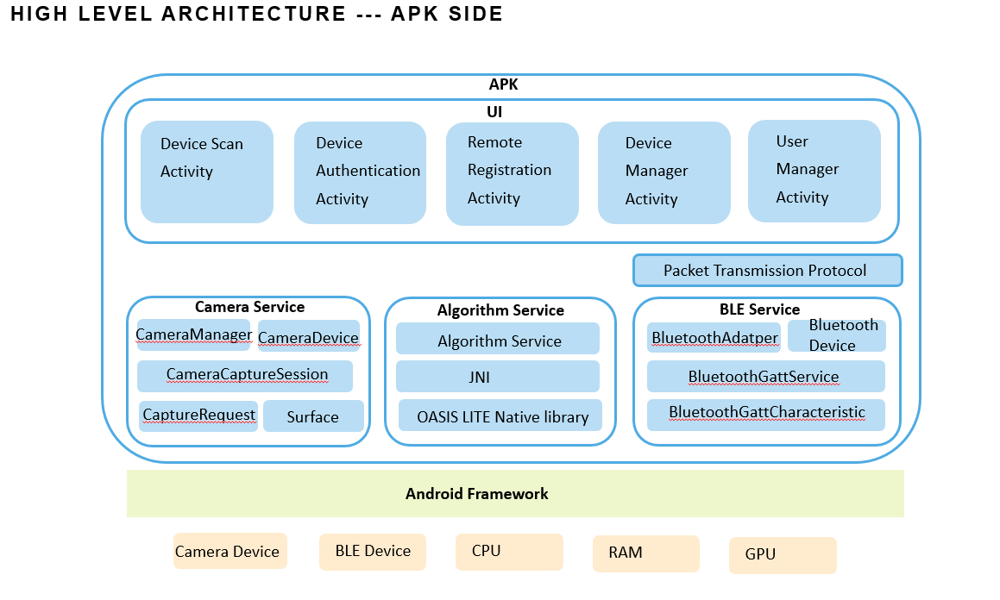
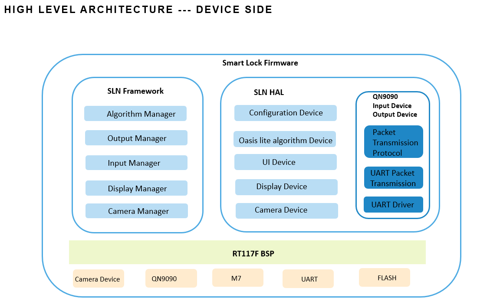
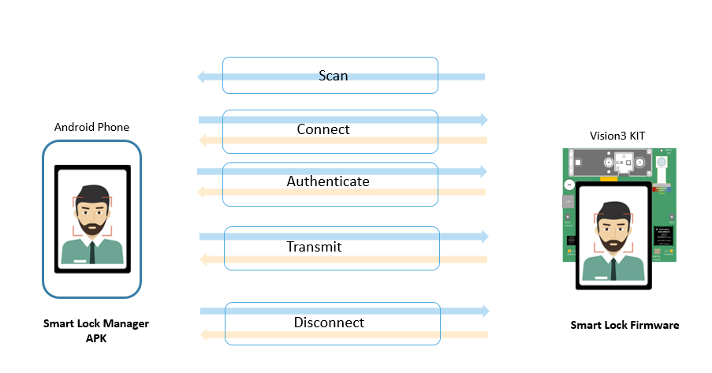
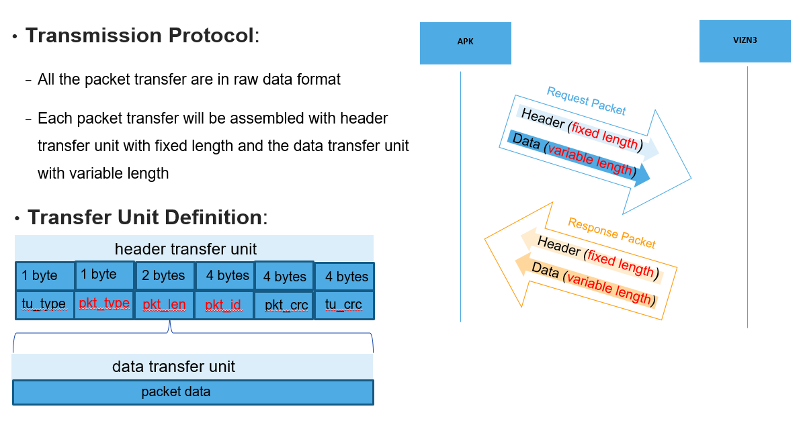
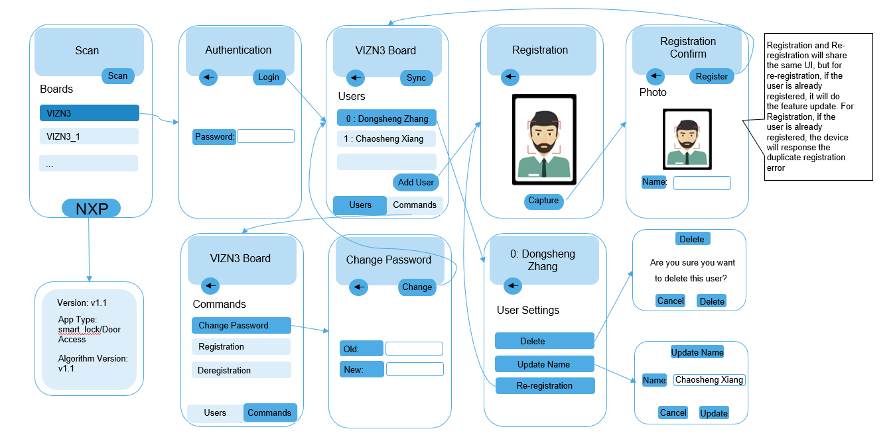

# Smart Lock Manager
Smart Lock Manager is an Android application to manage the smart lock device based on NXP's vison 3 solution through the BLE connection.

---
## Key Functions
- Feature based remote registration
- Device management
- User management
- Remote command

---

## Architecture

## Communication Process

## Transmission Protocol

## Packet Definition
- Refer [] (./doc/Vision 3.0 - Smart Lock Manager APK Architecture and Design V1.0.pptx)

## UI FLOW
